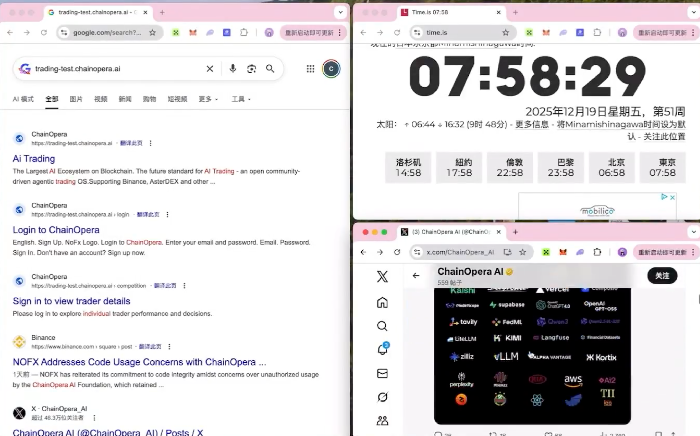

# AGPL 违规证据报告：ChainOpera 抄袭 NOFX

**报告日期**：2025年12月20日
**报告方**：NOFX 开源社区
**项目地址**：https://github.com/NoFxAiOS/nofx
**被指控方**：ChainOpera (COAI)
**涉及许可证**：GNU Affero General Public License v3.0 (AGPL-3.0)

---

## 一、摘要

ChainOpera 在其网站 `trading-test.chainopera.ai` 上使用了 NOFX 项目中受 AGPL-3.0 保护的 `equity-history-batch` API 接口设计，但拒绝公开源代码，违反了 AGPL-3.0 许可证条款。

ChainOpera 辩称该接口是"用 Python 重写的"，本报告将从法律和技术角度证明：**即使重写，仍构成 AGPL 违规**。

---

## 二、时间线证据

### 2.1 AGPL 许可证生效时间

| 项目 | 详情 |
|------|------|
| **生效时间** | 2025-11-03 19:50:50 (UTC+8) |
| **Commit Hash** | `e88f84215831d1682e05141eb0c27216dcbd6d47` |
| **提交者** | SkywalkerJi <skywalkerji.cn@gmail.com> |
| **提交说明** | "Upgrade this repository's open-source license to AGPL." |

### 2.2 equity-history-batch 接口创建时间

| 项目 | 详情 |
|------|------|
| **创建时间** | 2025-11-03 20:14:39 (UTC+8) |
| **Commit Hash** | `5af5c0b51773737f166eacea646e3960cee29f59` |
| **提交者** | icy <icyoung520@gmail.com> |
| **提交说明** | "Enhance leaderboard and security for trader management" |

### 2.3 关键结论

```
AGPL 生效时间：2025-11-03 19:50:50
接口创建时间：2025-11-03 20:14:39
时间差：24 分钟

结论：equity-history-batch 接口从诞生之日起就在 AGPL-3.0 保护下
```

---

## 三、技术证据：代码对比

### 3.1 API 路径对比

| 项目 | API 路径 | HTTP 方法 |
|------|----------|-----------|
| **NOFX** | `/api/equity-history-batch` | POST |
| **ChainOpera** | `/api/equity-history-batch` | POST |

**相似度：100%**

### 3.2 响应结构对比

**NOFX 原始代码** (`api/server.go` 第 2725-2729 行)：

```go
result["histories"] = histories
result["count"] = len(histories)
if len(errors) > 0 {
    result["errors"] = errors
}
```

**ChainOpera 实际返回**（网络请求截图）：


```json
{
  "histories": {...},
  "errors": {},
  "count": 1
}
```

**对比结果**：

| 字段 | NOFX | ChainOpera | 相似度 |
|------|-----------|------------|--------|
| `histories` | ✓ | ✓ | 100% |
| `errors` | ✓ | ✓ | 100% |
| `count` | ✓ | ✓ | 100% |

### 3.3 历史数据字段对比

**NOFX 原始代码** (`api/server.go` 第 2676-2682 行)：

```go
history = append(history, map[string]interface{}{
    "timestamp":     snap.Timestamp,
    "total_equity":  snap.TotalEquity,
    "total_pnl":     snap.UnrealizedPnL,
    "total_pnl_pct": pnlPct,
    "balance":       snap.Balance,
})
```

**ChainOpera 实际返回**：

```json
{
  "timestamp": "2025-12-15T11:21:05.432240",
  "balance": 227.30274403,
  "equity": 227.30274403,
  "total_pnl": 0
}
```

**对比结果**：

| NOFX 字段 | ChainOpera 字段 | 相似度 |
|----------------|-----------------|--------|
| `timestamp` | `timestamp` | 100% |
| `balance` | `balance` | 100% |
| `total_equity` | `equity` | 语义相同 |
| `total_pnl` | `total_pnl` | 100% |

### 3.4 独创性证据

`equity-history-batch` 是 NOFX 的**原创设计**：

1. **接口命名**：`equity-history-batch` 是自创的复合词，不是行业标准术语
2. **批量查询设计**：支持多个 trader_id 同时查询，是针对性能优化的独特设计
3. **响应结构**：`{histories, errors, count}` 三元组是原创设计
4. **时间过滤**：`hours` 参数设计是原创功能

---

## 四、"Python 重写"狡辩的法律反驳

### 4.1 AGPL-3.0 对"修改"的定义

**AGPL-3.0 第 0 条**：

> "To 'modify' a work means to copy from or adapt all or part of the work in a fashion requiring copyright permission, other than the making of an exact copy."
>
> "修改"作品是指以需要版权许可的方式复制或改编全部或部分作品，而不是制作精确副本。

**关键点**：用另一种语言重写（Go → Python）属于"改编"(adapt)，仍受 AGPL 约束。

### 4.2 派生作品的法律定义

**AGPL-3.0 第 0 条**：

> A "covered work" means either the unmodified Program or a work based on the Program.
>
> "受保护作品"是指未修改的程序或基于程序的作品。

**美国版权法 17 U.S.C. § 101**：

> A "derivative work" is a work based upon one or more preexisting works, such as a translation... in which a work may be recast, transformed, or adapted.
>
> "派生作品"是基于一个或多个既有作品的作品，例如翻译...其中作品可能被重铸、转换或改编。

**关键点**：将 Go 代码"翻译"为 Python 代码，属于法律定义的"派生作品"。

### 4.3 为什么"重写"仍然构成侵权

| 论点 | 法律分析 |
|------|----------|
| "我们用 Python 重写了" | 语言转换属于"改编"，派生作品仍需遵守原许可证 |
| "代码完全不同" | 版权保护的是**表达**，API 设计是一种表达形式 |
| "这是通用功能" | `equity-history-batch` 命名和 `{histories, errors, count}` 结构是独创设计，不是通用功能 |

### 4.4 类案参考

**Oracle v. Google (2021)**：

美国最高法院确认 API 设计受版权保护，即使谷歌重新实现了 Java API，仍需考虑版权问题。

**关键启示**：
- API 的**结构、顺序和组织** (Structure, Sequence, and Organization, SSO) 受版权保护
- 即使用不同语言实现，如果 API 设计相同，仍可能构成侵权

---

## 五、ChainOpera 需要回答的问题

ChainOpera 至今未回应以下核心问题：

| # | 问题 | ChainOpera 回应 |
|---|------|-----------------|
| 1 | 为何 API 路径与 NOFX 完全一致？ | ❌ 未回应 |
| 2 | 为何响应结构 `{histories, errors, count}` 完全一致？ | ❌ 未回应 |
| 3 | 为何字段名 `timestamp, balance, total_pnl` 完全一致？ | ❌ 未回应 |
| 4 | 如果是独立开发，为何与 NOFX 高度一致？ | ❌ 未回应 |
| 5 | 是否愿意依据 AGPL-3.0 公开源代码？ | ❌ 未回应 |

---

## 六、Git 证据验证方法

任何人都可以通过以下命令验证证据的真实性：

```bash
# 克隆仓库
git clone https://github.com/NoFxAiOS/nofx.git
cd nofx

# 验证 AGPL 许可证生效时间
git show e88f84215831d1682e05141eb0c27216dcbd6d47 --format="%H %ai %s" --no-patch
# 输出：e88f8421... 2025-11-03 19:50:50 +0800 Upgrade this repository's open-source license to AGPL.

# 验证 equity-history-batch 接口创建时间
git show 5af5c0b51773737f166eacea646e3960cee29f59 --format="%H %ai %s" --no-patch
# 输出：5af5c0b5... 2025-11-03 20:14:39 +0800 Enhance leaderboard and security for trader management

# 查看接口实现代码
git show 5af5c0b51773737f166eacea646e3960cee29f59:api/server.go | grep -A 50 "handleEquityHistoryBatch"
```

---

## 七、法律依据汇总

### 7.1 AGPL-3.0 关键条款

**第 13 条 - 远程网络交互**：

> Notwithstanding any other provision of this License, if you modify the Program, your modified version must prominently offer all users interacting with it remotely through a computer network... an opportunity to receive the Corresponding Source of your version.

**中文翻译**：

> 尽管本许可证有任何其他规定，如果您修改了程序，您的修改版本必须显著地向所有通过计算机网络远程与其交互的用户提供接收您版本的相应源代码的机会。

### 7.2 ChainOpera 的违规行为

| 违规项 | 描述 |
|--------|------|
| 使用 AGPL 代码 | 使用了 NOFX 的 API 设计 |
| 提供网络服务 | 在 `trading-test.chainopera.ai` 公开运营 |
| 未公开源代码 | 未提供源代码获取途径 |
| 未声明许可证 | 未声明使用了 AGPL 代码 |

---

## 八、额外证据：品牌与宣传语抄袭

### 8.1 Google 搜索结果证据



**截图时间**：2025年12月19日 07:58:29 (Time.is 第三方时间戳)

### 8.2 关键发现

| 证据项 | 内容 | 分析 |
|--------|------|------|
| **网站描述** | "The future standard for AI Trading - an open community-driven agentic trading OS" | 与 NOFX 宣传语高度一致 |
| **Login 页面** | 显示 "NoFx Logo" | 直接使用 NOFX 品牌资产 |

### 8.3 品牌侵权证据

ChainOpera 网站 `trading-test.chainopera.ai` 的 Login 页面 HTML 中包含 **"NoFx Logo"** 字样，证明：

1. ChainOpera 直接使用了 NOFX 的前端代码
2. 甚至未修改品牌相关的文字标识
3. 这不是"独立开发"或"Python 重写"，而是直接复制

---

## 九、证据清单

| # | 证据类型 | 描述 | 存证方式 |
|---|----------|------|----------|
| 1 | Git Commit | AGPL 许可证生效记录 | SHA-1: `e88f8421...` |
| 2 | Git Commit | equity-history-batch 创建记录 | SHA-1: `5af5c0b5...` |
| 3 | 源代码 | api/server.go 第 2542-2732 行 | Git 仓库 |
| 4 | 网站截图 | ChainOpera API 响应 | 区块链存证 |
| 5 | 网络请求 | trading-test.chainopera.ai 请求记录 | 建议公证 |
| 6 | Google 搜索 | "NoFx Logo" 品牌侵权证据 | 截图 + Time.is 时间戳 |

---

## 十、结论

1. **时间证据确凿**：`equity-history-batch` 接口在 AGPL 生效后 24 分钟创建，从诞生起即受保护

2. **技术证据充分**：API 路径、响应结构、字段命名高度一致，超出合理巧合范围

3. **"Python 重写"不成立**：
   - 语言转换属于"改编"，派生作品仍需遵守 AGPL
   - API 设计本身受版权保护
   - 相同的结构、顺序和组织证明是复制而非独立开发

4. **ChainOpera 必须**：
   - 公开其完整源代码，遵守 AGPL-3.0；或
   - 停止使用相关功能并下架服务

5. **基于已发生的侵权行为，NOFX 社区保留追究以下法律责任的权利**：
   - **禁令救济 (Injunctive Relief)**：立即停止使用 NOFX 的 AGPL 保护代码
   - **消除影响**：在 ChainOpera 官方渠道公开声明其使用了 NOFX 代码
   - **补偿性赔偿 (Compensatory Damages)**：赔偿权利人的实际损失或侵权人的违法所得
   - **法定赔偿 (Statutory Damages)**：依据适用司法管辖区法律主张法定赔偿
   - **承担维权费用**：包括但不限于公证费、律师费、诉讼费等合理支出

   **适用的国际法律框架**：
   - 《伯尔尼公约》(Berne Convention) - 计算机程序作为"文学作品"受保护
   - 《TRIPS协定》第10条 (WTO) - 计算机程序无论源代码或目标代码，均受版权保护
   - 《WIPO版权条约》第4条 (WCT) - 计算机程序作为文学作品受保护

---

## 十一、联系方式

如有任何问题，请联系：

- **GitHub Issues**: https://github.com/NoFxAiOS/nofx/issues
- **Email**: contact@vergex.trade

---

**声明**：本报告仅陈述事实和法律分析，NOFX 社区保留依法追究侵权责任的权利。

---

*报告版本：1.0*
*最后更新：2025-12-20*
