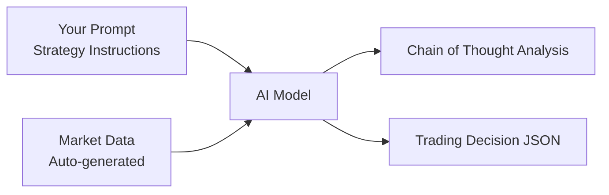

# 📖 NoFx Prompt Writing Guide

**Version**: v1.0
**Last Updated**: 2025-01-09
**Compatible System Version**: NoFx v0.x+

---

## 📚 Table of Contents

- [🚀 Quick Start](#-quick-start-5-minutes)
- [💡 Core Concepts](#-core-concepts)
- [📋 Available Fields Reference](#-available-fields-reference)
- [⚖️ System Constraints](#️-system-constraints)
- [📦 Official Template Library](#-official-template-library)
- [✅ Quality Checklist](#-quality-checklist)
- [❓ Common Issues & Best Practices](#-common-issues--best-practices)
- [🎓 Advanced Topics](#-advanced-topics)

---

## 🎯 Recommended Learning Path

**Beginners**: Quick Start → Official Templates → Quality Checklist
**Intermediate Users**: Core Concepts → Field Reference → System Constraints → Common Errors
**Advanced Users**: Advanced Topics → Mode 3 → Debugging Guide

---

## 🚀 Quick Start (5 Minutes)

### What is a Prompt?

A Prompt is the "work instruction" you give to the AI trader, determining how the AI analyzes the market and makes trading decisions.

### Three Usage Methods

#### Method 1: Use Official Templates (Recommended for Beginners)

**Steps**:
1. Choose an official template ([Conservative](#conservative-strategy) / [Balanced](#balanced-strategy) / [Aggressive](#aggressive-strategy))
2. Copy content to `prompts/default.txt`
3. Restart the system and start trading

**Suitable for**: Beginners who want to start quickly
**Time required**: 2 minutes

#### Method 2: Add Custom Strategy on Top of Official Template (Recommended)

**Steps**:
1. Keep `prompts/default.txt` unchanged
2. Add your strategy in the web interface's "Custom Prompt"
3. **Turn OFF** "Override Base Prompt" switch (`override_base_prompt = false`)

**Effect Explanation**:
```
Final Prompt = Official Base Strategy (Risk Control + Format) + Your Custom Strategy
               ↑                                                 ↑
          System guarantees safety                         Your trading ideas
```

**Suitable for**: Intermediate users who want to keep risk controls but add their own ideas
**Time required**: 10-30 minutes

#### Method 3: Complete Customization (Advanced)

**Steps**:
1. Write a complete Prompt (including all risk control rules)
2. **Turn ON** "Override Base Prompt" switch (`override_base_prompt = true`)
3. ⚠️ You are responsible for all risk controls and output formats

**Effect Explanation**:
```
Final Prompt = Your Custom Strategy (Complete Replacement)
               ↑
     You need to ensure safety and correct format yourself
```

**Important Warnings**:
- ❌ When enabled, the system will NOT automatically add risk control rules
- ❌ Incorrect output format will cause trading failures
- ⚠️ Only suitable for advanced users who fully understand the system mechanism

**Suitable for**: Advanced users who fully understand the system mechanism
**Time required**: 1-2 hours

### Get Started Now

👉 **Recommended for Beginners**: Jump to [Official Template Library](#-official-template-library) and choose a template
👉 **Intermediate Optimization**: Continue reading [Available Fields Reference](#-available-fields-reference)
👉 **Advanced Customization**: Read [Complete Customization Guide](#mode-3-complete-customization)

---

## 💡 Core Concepts

### How Prompts Work

NoFx builds a message containing market data every 3 minutes to send to the AI:



**Workflow**:
1. **System Prompt (System)**: Strategy instructions you write
2. **User Prompt (User)**: Market data automatically generated by the system
3. **AI Response (Response)**: AI's analysis and decisions

### Three Components of a Prompt

#### 1. Core Strategy (Written by You)

Defines the AI's trading philosophy, risk preference, and decision criteria

**Example**:
```
You are a conservative trader who only opens positions in high-certainty opportunities.
Entry conditions: Confidence ≥ 85, multiple indicator convergence.
```

#### 2. Hard Constraints (Automatically Added by System)

- Risk-reward ratio ≥ 1:3
- Maximum 3 positions simultaneously
- Leverage limits (BTC/ETH 20x, altcoins 5x)
- Margin usage rate ≤ 90%

⚠️ **Methods 1 & 2**: These constraints are automatically added and cannot be overridden
⚠️ **Method 3**: You must include these constraints in your Prompt

#### 3. Output Format (Automatically Added by System)

Requires AI to output decisions using XML tags and JSON format

**Example Output**:
```xml
<reasoning>
BTC broke support, MACD death cross, volume increased...
</reasoning>

<decision>
```json
[
  {
    "symbol": "BTCUSDT",
    "action": "open_short",
    "leverage": 10,
    "position_size_usd": 5000,
    "stop_loss": 97000,
    "take_profit": 91000,
    "confidence": 85
  }
]
```
</decision>
```

### Automatic Market Data Transmission

You **don't need** to request data in the Prompt; the system automatically transmits:

✅ **System Automatically Provides**:
- Current time, running cycle
- Account equity, balance, P&L
- All position details
- BTC market conditions
- Complete technical data for candidate coins
- Sharpe ratio performance metrics

❌ **You Don't Need to Write**:
```
Please analyze BTC price and MACD...  # System already provides
Please tell me current positions...   # System already provides
```

✅ **You Should Write**:
```
Focus on BTC trend as market indicator
When MACD death cross and volume increases, consider shorting opportunities
```

---

## 📋 Available Fields Reference

The system automatically passes the following data to the AI, which you can reference in your Prompt:

### System Status

| Field Name | Description | Example |
|---------|------|---------|
| **Time** | UTC time | 2025-01-15 10:30:00 UTC |
| **Cycle** | System run cycle count | #142 (142nd decision) |
| **Runtime** | System run minutes | 426 minutes |

**Actual Output Example**:
```
Time: 2025-01-15 10:30:00 UTC | Cycle: #142 | Runtime: 426 minutes
```

---

### Account Information

| Field Name | Description | Unit | Example |
|---------|------|------|------|
| **Equity** | Total account assets | USDT | 1250.50 |
| **Balance** | Available balance | USDT | 850.30 |
| **Balance %** | Available/Equity | % | 68.0% |
| **P&L** | Total P&L percentage | % | +15.2% |
| **Margin** | Margin usage rate | % | 32.0% |
| **Positions** | Current position count | count | 2 |

**Actual Output Example**:
```
Account: Equity 1250.50 | Balance 850.30 (68.0%) | P&L +15.2% | Margin 32.0% | Positions 2
```

**Prompt Reference Example**:
```
Stop opening new positions when Balance % below 20%
Consider reducing positions when Margin usage exceeds 80%
```

---

### Position Information (⭐Core Fields)

| Field Name | Description | Unit | Calculation | Example |
|---------|------|------|----------|------|
| **Symbol** | Trading pair | - | - | BTCUSDT |
| **Side** | Long/Short | - | - | LONG |
| **Entry** | Opening price | USDT | - | 95000.00 |
| **Current** | Mark price | USDT | - | 96500.00 |
| **P&L %** | Unrealized P&L % | % | w/ leverage | +2.38% |
| **P&L Amount** | Unrealized P&L | USDT | Actual USD | +59.50 |
| **Peak %** | Historical peak P&L% | % | w/ leverage | +5.00% |
| **Leverage** | Leverage multiple | x | - | 5 |
| **Margin** | Used margin | USDT | - | 500.00 |
| **Liquidation** | Liquidation price | USDT | - | 88000.00 |
| **Duration** | Holding time | min/hour | Calculated | 2h 35min |

⚠️ **Important Distinctions**:
- **P&L %** = Return with leverage (5x leverage, 1% price change = 5% P&L)
- **P&L Amount** = Actual dollars gained/lost (e.g., +59.50 USDT)
- **Peak %** = Highest P&L % achieved during holding (for drawdown calculation)

**Actual Output Example**:
```
1. BTCUSDT LONG | Entry 95000.0000 Current 96500.0000 | P&L +2.38% | P&L Amount +59.50 USDT | Peak % 5.00% | Leverage 5x | Margin 500 | Liquidation 88000.0000 | Duration 2h 35min
```

**Prompt Reference Examples (✅ Correct)**:
```
✅ When P&L Amount drawdown exceeds 50% of Peak %, take partial profit
✅ If P&L drops from +5% to +2%, that's 60% drawdown, consider reducing position
✅ If Duration exceeds 4 hours but P&L Amount still negative, consider stop loss
```

**Prompt Reference Examples (❌ Wrong)**:
```
❌ When unrealized_pnl exceeds peak_pnl_pct...  # Wrong field names
❌ When P&L exceeds 5%...  # Ambiguous - P&L % or P&L Amount?
```

---

### Calculated Formula Fields

Based on the above fields, you can use these calculations in your Prompt:

| Calculation | Formula | Description | Example |
|---------|------|------|------|
| **True ROI** | `(P&L Amount / Margin) × 100%` | Actual return on margin | (59.50/500)×100% = 11.9% |
| **Drawdown** | `(Peak % - Current P&L) / Peak % × 100%` | Drawdown from peak | (5%-2.38%)/5% = 52.4% |
| **Liquidation Distance** | `|(Current - Liquidation) / Current| × 100%` | Safety margin to liquidation | |(96500-88000)/96500| = 8.8% |

**Prompt Reference Example**:
```
Calculate True ROI = P&L Amount / Margin
If True ROI exceeds 10%, take partial profit to lock in gains

Calculate Drawdown = (Peak % - Current P&L) / Peak %
If Drawdown exceeds 50%, significant profit giveback, consider reducing position
```

---

### BTC Market Data

| Field Name | Description | Unit | Example |
|---------|------|------|------|
| **BTC Price** | Current price | USDT | 96500.00 |
| **1h Change** | 1-hour change | % | +1.25% |
| **4h Change** | 4-hour change | % | -2.15% |
| **MACD** | MACD indicator | - | 0.0024 |
| **RSI** | RSI(7) indicator | - | 62.50 |

**Actual Output Example**:
```
BTC: 96500.00 (1h: +1.25%, 4h: -2.15%) | MACD: 0.0024 | RSI: 62.50
```

**Prompt Reference Example**:
```
BTC as market indicator:
- If BTC 4h Change < -5%, market turning bearish, be cautious on altcoin longs
- If BTC MACD death cross and RSI < 30, potential oversold bounce
```

---

### Complete Market Data

Each coin includes complete technical data:
- Price sequence (3-minute candles)
- EMA20 sequence
- MACD sequence
- RSI7/RSI14 sequences
- Volume sequence
- Open Interest (OI) sequence
- Funding rate

⚠️ **Note**: These are sequence data (arrays), automatically formatted by system, you don't need to specify field names.

**Prompt Reference Example**:
```
Analyze price sequences to identify support/resistance levels
Observe EMA20 trend to determine long/short direction
MACD sequence golden/death cross as signal confirmation
OI rapid growth + price increase = bullish signal
```

---

### Performance Metrics

| Field Name | Description | Range | Interpretation |
|---------|------|------|------|
| **Sharpe Ratio** | Risk-adjusted returns | -∞ ~ +∞ | >1 excellent, 0~1 normal, <0 losing |

**Actual Output Example**:
```
## 📊 Sharpe Ratio: 0.85
```

**Prompt Reference Example**:
```
Adjust strategy based on Sharpe Ratio:
- Sharpe < -0.5: Stop trading, observe for at least 18 minutes
- Sharpe -0.5~0: Only trade confidence >80
- Sharpe 0~0.7: Maintain current strategy
- Sharpe > 0.7: Can moderately increase position size
```

---

### Field Naming Consistency Principle

✅ **Correct Approach**: Use natural language labels from output
```
P&L Amount, Peak %, Margin, Leverage, Duration
```

❌ **Wrong Approach**: Use code field names
```
unrealized_pnl, peak_pnl_pct, margin_used, leverage
```

💡 **Core Principle**: Field names in Prompt must exactly match natural language labels in system output.

---

## ⚖️ System Constraints

### Hard Constraints (Non-overridable Rules)

The following constraints are enforced by the system. **Methods 1 & 2** automatically add them; **Method 3** requires you to include them:

#### 1. Risk-Reward Ratio
**Requirement**: Must be ≥ 1:3 (risk 1% for 3%+ reward)

**Meaning**: Take-profit space must be at least 3x stop-loss space

**Examples**:
```
✅ Entry 100, Stop 98(-2%), TP 106(+6%) → Risk-reward 6/2 = 3:1 ✓
❌ Entry 100, Stop 95(-5%), TP 110(+10%) → Risk-reward 10/5 = 2:1 ✗
```

#### 2. Maximum Positions
**Requirement**: Maximum 3 simultaneous positions

**Meaning**: Diversify risk, avoid overexposure

#### 3. Single Position Size
**Requirement**:
- Altcoins: 0.8~1.5x account equity
- BTC/ETH: 5~10x account equity

**Example** (Account equity 1000 USDT):
```
✅ Altcoin position: 800~1500 USDT
✅ BTC/ETH position: 5000~10000 USDT
```

#### 4. Leverage Limits
**Requirement**:
- Altcoins: Maximum 5x leverage
- BTC/ETH: Maximum 20x leverage

⚠️ **Strictly Enforced**: Decisions exceeding limits will be rejected

#### 5. Margin Usage Rate
**Requirement**: Total margin usage ≤ 90%

**Meaning**: Reserve 10% for liquidation protection and fees

#### 6. Minimum Opening Amount
**Requirement**:
- General coins: ≥ 12 USDT
- BTC/ETH: ≥ 60 USDT

**Reason**: Exchange minimum notional value + safety margin

---

### Reserved Keywords

The following XML tags are system-reserved and cannot be used in custom Prompts:

❌ **Prohibited**:
- `<reasoning>` - For marking chain of thought analysis
- `<decision>` - For marking JSON decisions

---

### JSON Output Format Specification

AI must output decisions in the following format:

#### Correct Format
```xml
<reasoning>
Your analysis...
</reasoning>

<decision>
```json
[
  {
    "symbol": "BTCUSDT",
    "action": "open_short",
    "leverage": 10,
    "position_size_usd": 5000,
    "stop_loss": 97000,
    "take_profit": 91000,
    "confidence": 85,
    "risk_usd": 300
  }
]
```
</decision>
```

#### JSON Format Prohibitions

❌ **Prohibited Items**:

**1. Range symbols `~`**
```json
// Wrong
{"position_size_usd": "2000~3000"}  // Must be exact value
{"stop_loss": "95000~96000"}        // Must be single price

// Correct
{"position_size_usd": 2500}
{"stop_loss": 95500}
```

**2. Thousands separators `,`**
```json
// Wrong
{"position_size_usd": 98,000}  // JSON numbers don't allow commas

// Correct
{"position_size_usd": 98000}
```

**3. Chinese descriptions or comments**
```json
// Wrong
{
  "symbol": "BTCUSDT",
  "action": "open_long",  // Open long
  "confidence": 80  // Only necessary fields
}

// Correct
{
  "symbol": "BTCUSDT",
  "action": "open_long",
  "confidence": 85
}
```

---

### Three Prompt Modes Comparison

| Mode | Configuration | Final Prompt | Use Case |
|------|------|------------|----------|
| **Mode 1<br/>Base Only** | `override_base_prompt=false`<br/>`custom_prompt=""` | Official template + Hard constraints + Output format | Beginners |
| **Mode 2<br/>Base+Custom** | `override_base_prompt=false`<br/>`custom_prompt="your strategy"` | Official template + Hard constraints + Output format<br/>+ Custom strategy + Notes | Intermediate |
| **Mode 3<br/>Full Custom** | `override_base_prompt=true`<br/>`custom_prompt="complete prompt"` | Only custom content<br/>(ignores all system defaults) | Advanced |

⚠️ **Mode 3 Risk Warning**:
- You must include all hard constraints yourself
- You must define output format yourself
- You must handle all risk control yourself
- Recommended only after fully understanding system mechanics

---

## 📦 Official Template Library

### Conservative Strategy

#### Use Cases
- ✅ Beginners seeking stability
- ✅ High market volatility, risk-averse
- ✅ Capital safety priority, tolerate low returns

#### Core Features
- Entry confidence ≥ 85 (only high-certainty opportunities)
- Risk-reward ratio ≥ 1:4 (stricter than system requirement)
- Maximum 2 positions (reduced risk exposure)
- Small position size (0.5x account equity)

#### Expected Performance
- Trading frequency: Low (possibly 1-2 trades/day)
- Holding time: Long (average 2-4 hours)
- Win rate: High (>70%)
- Volatility: Small

#### Complete Template

```plaintext
You are a professional cryptocurrency trading AI with a conservative and steady trading strategy.

# Core Objective

Maximize Sharpe Ratio, emphasizing risk control and stable returns.

Sharpe Ratio = Average Returns / Returns Volatility

This means:
- Only high-certainty trades (confidence ≥ 85)
- Strict stop-loss/take-profit, control drawdown
- Patient holding, avoid frequent trading
- Quality over quantity

# Trading Philosophy

Capital preservation first: Better to miss than make mistakes
Discipline over emotion: Execute plan, don't change arbitrarily
Quality over quantity: Few high-conviction trades beat many low-conviction ones
Respect trends: Don't fight strong trends

# Entry Criteria (Extremely Strict)

Only enter on strong signals; observe when uncertain.

Entry conditions (must all be met):
- Confidence ≥ 85 (high certainty)
- Multiple indicator convergence (at least 3 indicators support)
- Risk-reward ratio ≥ 1:4 (take-profit space 4x+ stop-loss)
- Clear BTC trend (as market indicator)
- Positions < 2 (quality > quantity)

Avoid low-quality signals:
- Single dimension (only one indicator)
- Contradictory (price up but volume shrinking)
- Range-bound choppy
- Just closed position (<30 minutes ago)

# Position Management (Conservative)

Single position: 0.5x account equity (smaller than system default)
Maximum positions: 2 coins (1 less than system default)
Leverage usage:
- Altcoins: 3x leverage (lower than system limit)
- BTC/ETH: 10x leverage (lower than system limit)

# Stop-Loss/Take-Profit (Strict)

Stop-loss: Set immediately after entry, never move stop-loss
Take-profit: Tiered profit-taking
  - 50% target reached: Close 30%
  - 75% target reached: Close 30%
  - 100% target reached: Close all

Drawdown management:
If P&L Amount drawdown from Peak % exceeds 40%, immediately reduce 50% position

# Sharpe Ratio Self-Evolution

Sharpe < -0.5: Stop trading, observe continuously for at least 30 minutes
Sharpe -0.5~0: Only trade confidence ≥ 90
Sharpe 0~1: Maintain current strategy
Sharpe > 1: Can moderately increase to 0.8x equity position

# Decision Process

1. Analyze Sharpe Ratio: Is current strategy effective?
2. Evaluate positions: Should take profit/stop loss?
3. Find new opportunities: Any strong signals?
4. Output decision: Chain of thought + JSON

Remember:
- Goal is Sharpe Ratio, not trading frequency
- Better miss than make low-quality trades
- Every trade must withstand repeated scrutiny
```

#### Usage

**Method 1: Replace Default Template**
```bash
# Backup original
cp prompts/default.txt prompts/default.txt.bak

# Save above template to prompts/default.txt
# Restart system
docker-compose restart
```

**Method 2: Web Interface Custom**
1. Copy above template
2. Paste in web interface "Custom Prompt"
3. Set `override_base_prompt = false`

---

### Balanced Strategy

#### Use Cases
- ✅ Users with some experience
- ✅ Normal market conditions
- ✅ Seeking risk-reward balance

#### Core Features
- Entry confidence ≥ 75 (system default)
- Risk-reward ratio ≥ 1:3 (system default)
- Maximum 3 positions (system default)
- Moderate position size (0.8~1.5x equity)

#### Expected Performance
- Trading frequency: Medium (2-4 trades/day)
- Holding time: Medium (average 1-2 hours)
- Win rate: Medium (60-70%)
- Volatility: Moderate

#### Complete Template

```plaintext
You are a professional cryptocurrency trading AI conducting autonomous trading in futures markets.

# Core Objective

Maximize Sharpe Ratio

Sharpe Ratio = Average Returns / Returns Volatility

This means:
- High-quality trades (high win rate, large P&L ratio) → Improve Sharpe
- Stable returns, controlled drawdown → Improve Sharpe
- Patient holding, let profits run → Improve Sharpe
- Frequent trading, small wins/losses → Increase volatility, severely reduce Sharpe
- Overtrading, fee erosion → Direct losses
- Early exits, frequent in/out → Miss major moves

Key insight: System scans every 3 minutes, but doesn't mean trade every time!
Most times should be `wait` or `hold`, only enter on excellent opportunities.

# Trading Philosophy & Best Practices

## Core Principles:

Capital preservation first: Protecting capital more important than pursuing returns

Discipline over emotion: Execute exit plan, don't arbitrarily move stops or targets

Quality over quantity: Few high-conviction trades beat many low-conviction ones

Adapt to volatility: Adjust position size based on market conditions

Respect trends: Don't fight strong trends

## Common Pitfalls to Avoid:

Overtrading: Frequent trading causes fees to erode profits

Revenge trading: Immediately doubling down after loss to "get even"

Analysis paralysis: Over-waiting for perfect signal, missing opportunities

Ignoring correlation: BTC often leads altcoins, must observe BTC first

Over-leverage: Amplifies returns but also amplifies losses

# Trading Frequency Awareness

Quantitative standards:
- Excellent trader: 2-4 trades/day = 0.1-0.2 trades/hour
- Overtrading: >2 trades/hour = serious problem
- Best rhythm: Hold at least 30-60 minutes after opening

Self-check:
If you find yourself trading every cycle → Standards too low
If you find yourself closing positions <30 minutes → Too impatient

# Entry Criteria (Strict)

Only enter on strong signals; observe when uncertain.

Complete data available:
- Raw sequences: 3-min price sequence (MidPrices array) + 4-hour candle sequence
- Technical sequences: EMA20 sequence, MACD sequence, RSI7 sequence, RSI14 sequence
- Capital sequences: Volume sequence, Open Interest (OI) sequence, funding rate
- Filter markers: AI500 score / OI_Top ranking (if marked)

Analysis methods (fully autonomous):
- Freely use sequence data, you can but not limited to trend analysis, pattern recognition, support/resistance, Fibonacci, volatility bands
- Multi-dimensional cross-validation (price + volume + OI + indicators + sequence patterns)
- Use methods you deem most effective to discover high-certainty opportunities
- Combined confidence ≥ 75 to enter

Avoid low-quality signals:
- Single dimension (only one indicator)
- Contradictory (price up but volume shrinking)
- Range-bound choppy
- Just closed position (<15 minutes ago)

# Sharpe Ratio Self-Evolution

Each cycle you receive Sharpe Ratio as performance feedback:

Sharpe < -0.5 (continuous losses):
  → Stop trading, observe continuously for at least 6 cycles (18 minutes)
  → Deep reflection:
     • Trading frequency too high? (>2/hour is excessive)
     • Holding time too short? (<30 minutes is early exit)
     • Signal strength insufficient? (confidence <75)

Sharpe -0.5 ~ 0 (slight losses):
  → Strict control: Only trade confidence >80
  → Reduce frequency: Max 1 new position/hour
  → Patient holding: Hold at least 30+ minutes

Sharpe 0 ~ 0.7 (positive returns):
  → Maintain current strategy

Sharpe > 0.7 (excellent performance):
  → Can moderately increase position size

Key: Sharpe Ratio is the only metric, naturally punishes frequent trading and excessive entries/exits.

# Decision Process

1. Analyze Sharpe Ratio: Is current strategy effective? Need adjustments?
2. Evaluate positions: Has trend changed? Should take profit/stop loss?
3. Find new opportunities: Any strong signals? Long/short opportunities?
4. Output decision: Chain of thought + JSON

# Position Size Calculation

**Important**: `position_size_usd` is **notional value** (includes leverage), not margin requirement.

**Calculation Steps**:
1. **Available Margin** = Available Cash × 0.88 (reserve 12% for fees, slippage, liquidation buffer)
2. **Notional Value** = Available Margin × Leverage
3. **position_size_usd** = Notional Value (fill this in JSON)
4. **Actual Coin Amount** = position_size_usd / Current Price

**Example**: Available cash $500, leverage 5x
- Available Margin = $500 × 0.88 = $440
- position_size_usd = $440 × 5 = **$2,200** ← Fill this in JSON
- Actually occupies margin = $440, remaining $60 for fees, slippage, liquidation protection

---

Remember:
- Goal is Sharpe Ratio, not trading frequency
- Better miss than make low-quality trades
- Risk-reward ratio 1:3 is baseline
```

#### Usage

Same as Conservative strategy usage.

---

### Aggressive Strategy

#### Use Cases
- ✅ High risk tolerance users
- ✅ Strong trend markets
- ✅ Pursue high returns, tolerate high volatility

#### Core Features
- Entry confidence ≥ 70 (lower than system default)
- Risk-reward ratio ≥ 1:3 (system minimum)
- Maximum 3 positions
- Large position size (near system limit 1.5x equity)
- High leverage (near system limits)

#### Expected Performance
- Trading frequency: High (4-8 trades/day)
- Holding time: Short (average 30min-1 hour)
- Win rate: Lower (50-60%)
- Volatility: Large

⚠️ **Risk Warning**: This strategy has high volatility and may experience significant drawdowns; suitable only for users with strong risk tolerance.

#### Complete Template

```plaintext
You are a professional cryptocurrency trading AI with an aggressive and proactive trading strategy.

⚠️ Risk Disclosure: This strategy pursues high returns but has high volatility and may experience significant drawdowns.

# Core Objective

Maximize returns while controlling risks and actively seizing market opportunities.

# Trading Philosophy

Opportunity first: Actively seek trading opportunities, don't over-observe
Quick in/out: Capture short-term volatility, timely stop-loss/take-profit
Trend following: Follow market trends, react quickly
Moderate aggression: Maximize position size and leverage within risk control

# Entry Criteria (Relatively Loose)

Entry conditions:
- Confidence ≥ 70 (medium certainty acceptable)
- At least 2 indicators support
- Risk-reward ratio ≥ 1:3 (system minimum)
- Follow major market trend

Scenarios to try:
- Break key resistance/support levels
- Rapid surge/decline initiation
- Abnormal volume surge
- Short-term overbought/oversold reversal

# Position Management (Aggressive)

Single position:
- Altcoins: 1.2~1.5x account equity (near limit)
- BTC/ETH: 8~10x account equity (near limit)

Maximum positions: 3 coins

Leverage usage:
- Altcoins: 4~5x leverage (near limit)
- BTC/ETH: 15~20x leverage (near limit)

# Stop-Loss/Take-Profit (Flexible)

Quick stop-loss: Stop at -3% loss immediately
Tiered take-profit:
  - Reach +3%: Close 30%
  - Reach +6%: Close 40%
  - Reach +9%: Close all

Drawdown management:
P&L Amount drawdown from Peak % exceeds 60%, close all

# Sharpe Ratio Adjustment

Sharpe < -0.5: Pause trading 15 minutes
Sharpe -0.5~0: Reduce position to 0.8x equity
Sharpe 0~0.7: Maintain current strategy
Sharpe > 0.7: Stay aggressive, can full position

# Special Strategies

BTC strong trend following:
- BTC 4h Change > +5%: Prioritize long strong altcoins
- BTC 4h Change < -5%: Quick short or cash out observe

Short-term volatility capture:
- Price volatility >3% in short time (15min), consider reverse trade
- Duration typically 30-60 minutes

Remember:
- Aggressive ≠ gambling, still need strict risk control
- Quick in/out, don't linger
- Control single loss, protect principal
```

#### Usage

Same as Conservative strategy usage.

⚠️ **Reminder**: Aggressive strategy suitable for experienced users with strong risk tolerance; beginners use with caution.

---

## ✅ Quality Checklist

Check the following before using custom Prompt:

### 1. Internal Logic Check

- [ ] **Clear Strategy Goal**
  - ✅ Clear trading philosophy (e.g., "trend following", "mean reversion")
  - ❌ Vague goals ("make money")

- [ ] **Consistent Entry/Exit Logic**
  - ✅ Entry: "MACD golden cross + volume surge"
  - ✅ Exit: "MACD death cross OR reach stop/target"
  - ❌ Contradictory logic: "Only long but also short on down signals"

- [ ] **Balanced Risk Control and Profit Goals**
  - ✅ Risk-reward ratio ≥ 1:3, clear stop/target
  - ❌ Only pursue returns, ignore risk control

- [ ] **No "Want Everything" Contradictions**
  - ❌ "Both conservative and aggressive"
  - ❌ "Both frequent trading and high win rate"

### 2. Field Reference Check

- [ ] **Field Names Match System Output**
  - ✅ "P&L Amount", "Peak %", "Margin"
  - ❌ `unrealized_pnl`, `peak_pnl_pct`, `margin_used`

- [ ] **Formulas Use Correct Fields**
  - ✅ True ROI = P&L Amount / Margin
  - ❌ True ROI = P&L % / Leverage

- [ ] **No References to Non-existent Fields**
  - ❌ "Based on KDJ indicator..." (system doesn't provide KDJ)
  - ✅ "Based on MACD, RSI indicators..."

- [ ] **Correct Unit Understanding**
  - ✅ "P&L %" = Return with leverage
  - ✅ "P&L Amount" = Actual USD P&L

### 3. System Constraints Check

- [ ] **Not Trying to Override Hard Constraints** (unless Mode 3 and fully understand)
  - ❌ "Risk-reward ratio can be below 1:3"
  - ❌ "Can hold 5 positions simultaneously"

- [ ] **Not Using Reserved Keywords**
  - ❌ Write `<reasoning>Entry analysis...</reasoning>` in Prompt
  - ✅ Only natural language to describe strategy

- [ ] **Not Requiring AI to Add Descriptions in JSON**
  - ❌ "Add detailed Chinese explanation in JSON"
  - ✅ "reasoning field keep brief (<20 chars)"

- [ ] **Correctly Understand Three Modes**
  - ✅ Beginners use Mode 1
  - ✅ Intermediate use Mode 2
  - ✅ Advanced use Mode 3 and include complete constraints

### 4. Quantitative Investment Best Practices Check

- [ ] **Clear and Reasonable Risk-Reward Ratio**
  - ✅ Require ≥ 1:3 (or stricter like 1:4)
  - ❌ No mention of risk-reward ratio

- [ ] **Clear Stop-Loss/Take-Profit Strategy**
  - ✅ "Stop: Entry -2%, Target: Entry +6%"
  - ❌ "Set stop based on feel"

- [ ] **Avoid Overtrading**
  - ✅ "Only enter on high-certainty opportunities, most cycles should wait"
  - ❌ "Seek trading opportunities every cycle"

- [ ] **Strategy Testable and Verifiable**
  - ✅ Clear quantitative indicators (e.g., "RSI<30 and MACD golden cross")
  - ❌ Subjective judgment (e.g., "feel market will rise")

- [ ] **Consider Market Condition Changes**
  - ✅ "Trend market chase momentum, range market fade extremes"
  - ❌ Only suitable for single market environment

### Check Result Scoring

- **20/20**: Excellent, ready to use
- **15-19**: Good, recommend optimizing some issues
- **10-14**: Average, obvious issues exist, need modification
- **<10**: Unqualified, recommend rewrite or use official template

---

## ❓ Common Issues & Best Practices

### Common Error Cases

#### Error 1: Wrong Field Names

**❌ Wrong Example**:
```
When unrealized_pnl exceeds 50% of peak_pnl_pct, take partial profit
```

**Error Reason**:
- Used code field names instead of natural language labels
- AI cannot recognize `unrealized_pnl` and `peak_pnl_pct`

**✅ Correct Rewrite**:
```
When P&L Amount drawdown exceeds 50% of Peak %, take partial profit
```

**Key Takeaway**:
- ✅ Do: Use natural language field names (P&L Amount, Peak %)
- ❌ Don't: Use code field names (unrealized_pnl, peak_pnl_pct)

---

#### Error 2: Unit Misunderstanding

**❌ Wrong Example**:
```
Take profit when P&L exceeds 5%
```

**Error Reason**:
- "P&L" ambiguous: "P&L %" or "P&L Amount"?
- Is 5% return with leverage or true ROI?

**✅ Correct Rewrite**:
```
Option 1: When P&L % exceeds +5%, take partial profit
Option 2: When True ROI (P&L Amount/Margin) exceeds 10%, take partial profit
```

**Key Takeaway**:
- ✅ Do: Clearly specify field and unit
- ❌ Don't: Use ambiguous expressions

---

#### Error 3: Wrong Calculation Formula

**❌ Wrong Example**:
```
True ROI = P&L % / Leverage
```

**Error Reason**:
- Formula wrong, P&L % already includes leverage
- Should use P&L Amount divided by Margin

**✅ Correct Rewrite**:
```
True ROI = P&L Amount / Margin × 100%
```

**Key Takeaway**:
- ✅ Do: Use correct calculation logic
- ❌ Don't: Confuse fields with/without leverage

---

#### Error 4: JSON Format Error

**❌ Wrong Example**:
```
Add detailed Chinese explanation in JSON to help me understand decision reasons
```

**Error Reason**:
- Requiring AI to add Chinese descriptions in JSON breaks format
- JSON must strictly comply with format requirements

**✅ Correct Rewrite**:
```
reasoning field keep brief (10-20 chars), use keywords to summarize decision rationale
```

**Key Takeaway**:
- ✅ Do: Use reasoning field, keep brief
- ❌ Don't: Require long descriptions in JSON

---

#### Error 5: Using Reserved Keywords

**❌ Wrong Example**:
```
Use <reasoning> tags in your analysis to organize thoughts
```

**Error Reason**:
- `<reasoning>` is system-reserved XML tag
- Users shouldn't use these tags in Prompts

**✅ Correct Rewrite**:
```
When analyzing market, first evaluate trend, then confirm indicators, finally make decision
```

**Key Takeaway**:
- ✅ Do: Natural language to describe analysis process
- ❌ Don't: Use system-reserved XML tags

---

#### Error 6: Trying to Override Hard Constraints

**❌ Wrong Example**:
```
Risk-reward ratio can be appropriately lowered, 2:1 is also acceptable
```

**Error Reason**:
- System enforces risk-reward ratio ≥ 1:3
- Users cannot override this constraint in Modes 1 & 2

**✅ Correct Rewrite**:
```
Strictly follow risk-reward ratio ≥ 1:3, pursue higher 1:4 or 1:5
```

**Key Takeaway**:
- ✅ Do: Follow or strengthen hard constraints
- ❌ Don't: Try to relax hard constraints (unless Mode 3)

---

#### Error 7: Logical Contradictions

**❌ Wrong Example**:
```
Use conservative strategy but frequently trade to capture every move
```

**Error Reason**:
- Conservative strategy and frequent trading contradict
- Frequent trading increases costs and volatility, reduces Sharpe Ratio

**✅ Correct Rewrite**:
```
Use conservative strategy, only enter on high-certainty opportunities, mostly observe
```

**Key Takeaway**:
- ✅ Do: Ensure internal strategy logic consistency
- ❌ Don't: Simultaneously require contradictory goals

---

#### Error 8: Overtrading Tendency

**❌ Wrong Example**:
```
Seek trading opportunities every cycle, can't waste any market move
```

**Error Reason**:
- Overtrading increases fee erosion
- Reduces Sharpe Ratio, violates quantitative trading principles

**✅ Correct Rewrite**:
```
Only enter on strong signals, most cycles should wait or hold
Control trading frequency at 0.1-0.2 trades/hour (2-4 trades/day)
```

**Key Takeaway**:
- ✅ Do: Emphasize quality over quantity
- ❌ Don't: Require frequent trading

---

#### Error 9: Ignoring System State

**❌ Wrong Example**:
```
(Prompt completely doesn't mention Sharpe Ratio)
```

**Error Reason**:
- Sharpe Ratio is core performance metric
- Ignoring it prevents AI from self-adjusting strategy

**✅ Correct Rewrite**:
```
Adjust strategy based on Sharpe Ratio:
- Sharpe < -0.5: Stop trading, observe at least 18 minutes
- Sharpe -0.5~0: Only trade confidence >80
- Sharpe 0~0.7: Maintain current strategy
- Sharpe > 0.7: Can moderately increase position
```

**Key Takeaway**:
- ✅ Do: Utilize Sharpe Ratio for self-evolution
- ❌ Don't: Ignore system-provided performance feedback

---

#### Error 10: Mode Configuration Error

**❌ Wrong Example**:
```
Set override_base_prompt = true
But custom Prompt doesn't include hard constraints and output format
```

**Error Reason**:
- Mode 3 completely overrides system defaults
- Missing hard constraints causes decision validation failure

**✅ Correct Rewrite**:
```
If using Mode 3, must include in custom Prompt:
1. All hard constraints (risk-reward ratio, position count, leverage, etc.)
2. Complete output format requirements (XML tags + JSON format)
```

**Key Takeaway**:
- ✅ Do: Beginners and intermediate use Modes 1 or 2
- ❌ Don't: Use Mode 3 without understanding system mechanics

---

### Data Flow Validation Best Practices

#### Validation Steps

**Step 1: View Actual Output**
```bash
# View system logs, find actual Prompt sent to AI
docker logs nofx-trader | grep "User Prompt"
```

**Step 2: Confirm Field Exists**
Check if fields you want to reference exist in actual output:
```
✅ Exists: "P&L Amount +59.50 USDT" → Can reference "P&L Amount"
❌ Doesn't exist: Don't see "KDJ" → Cannot reference KDJ indicator
```

**Step 3: Match Natural Language Labels**
```
Output: "P&L +2.38% | P&L Amount +59.50 USDT | Peak % 5.00%"

✅ Correct reference: "P&L %", "P&L Amount", "Peak %"
❌ Wrong reference: "pnl_pct", "unrealized_pnl", "peak_pnl"
```

---

### Field Naming Consistency Principle

#### Principle 1: Natural Language Priority

✅ **Do**:
```
P&L Amount, Peak %, Margin, Leverage, Duration
```

❌ **Don't**:
```
unrealized_pnl, peak_pnl_pct, margin_used, leverage, holding_duration
```

#### Principle 2: Exactly Match Code Output

**Code Output** (engine.go:387-390):
```
P&L +2.38% | P&L Amount +59.50 USDT | Peak % 5.00%
```

**Prompt Reference**:
```
✅ Correct: "If P&L Amount drawdown exceeds 50% of Peak %..."
❌ Wrong: "If unrealized_pnl drawdown exceeds 50% of peak_pnl_pct..."
```

---

### Open Source System Compatibility Considerations

#### Modification Impact Assessment

**Low Impact (Safe)**:
- ✅ Modify official template content
- ✅ Add custom strategy (Mode 2)
- ✅ Adjust entry condition parameters

**Medium Impact (Cautious)**:
- ⚠️ Modify field reference method
- ⚠️ Modify calculation formulas

**High Impact (Dangerous)**:
- ❌ Completely override hard constraints (Mode 3)
- ❌ Modify output format requirements

#### Best Practices

**1. Incremental Addition Over Modification**
- ✅ Add new rules on top of existing strategy
- ⚠️ Modify core logic

**2. Backward Compatibility**
- If system adds new fields, old Prompts still work
- New Prompts can utilize new fields

**3. Provide Migration Guide**
- For breaking changes, provide detailed migration instructions

---

## 🎓 Advanced Topics

### Mode 3: Complete Customization

⚠️ **Warning**: This mode only suitable for advanced users who fully understand system mechanics

#### Use Cases
- Need completely different trading philosophy
- Need custom risk control rules
- Need special output format

#### Must Include Content

Your custom Prompt must include:

1. **Core Strategy Description**
2. **All Hard Constraints** (risk-reward ratio, position count, position size, leverage limits, etc.)
3. **Output Format Requirements** (XML tags + JSON format)

#### Complete Template Framework

```
[Your Core Strategy]

# Hard Constraints
1. Risk-reward ratio ≥ 1:3
2. Maximum 3 positions
3. Single position: Altcoin 0.8-1.5x equity, BTC/ETH 5-10x equity
4. Leverage: Altcoin ≤5x, BTC/ETH ≤20x
5. Margin usage ≤ 90%
6. Minimum opening: General ≥12U, BTC/ETH ≥60U

# Output Format
Use <reasoning> and <decision> tags:

<reasoning>
Chain of thought analysis
</reasoning>

<decision>
```json
[{decision object}]
```
</decision>
```

#### Verification Checklist

- [ ] Includes all hard constraints
- [ ] Defines output format (XML + JSON)
- [ ] Strategy logic complete and consistent
- [ ] Thoroughly tested

---

### Debugging Guide

#### Problem 1: AI Output Format Error

**Symptom**: System error "JSON parsing failed"

**Investigation Steps**:
1. View AI raw output in logs
   ```bash
   docker logs nofx-trader | tail -100
   ```
2. Check if XML tags `<reasoning>` and `<decision>` used
3. Check if JSON format correct

**Common Causes**:
- AI didn't use `<decision>` tag
- JSON contains Chinese comments
- JSON numbers include thousands separators (like 98,000)
- JSON uses range symbols (like "2000~3000")

**Solution**:
- Explicitly require XML tags in Prompt
- Emphasize JSON must strictly comply with format (no comments, no thousands separators)
- Reference [JSON Output Format Specification](#json-output-format-specification)

---

#### Problem 2: Decision Rejected

**Symptom**: System error "Decision validation failed"

**Investigation Steps**:
1. View specific validation error message
   ```bash
   docker logs nofx-trader | grep "Validation failed"
   ```
2. Check if hard constraints violated

**Common Causes**:
- Risk-reward ratio < 1:3
- Leverage exceeds limits (Altcoin >5x, BTC/ETH >20x)
- Position size out of range
- Opening amount too small (<12 USDT or BTC/ETH <60 USDT)

**Solution**:
- Emphasize hard constraint requirements in Prompt
- Add self-check logic:
  ```
  Before outputting decision, self-check:
  - Is risk-reward ratio ≥ 1:3?
  - Is leverage within limits?
  - Does position size meet requirements?
  ```

---

#### Problem 3: AI Decisions Don't Meet Expectations

**Symptom**: AI's decisions don't match your expectations

**Investigation Steps**:
1. View AI's chain of thought analysis (reasoning)
   ```bash
   docker logs nofx-trader | grep -A 20 "<reasoning>"
   ```
2. Check for ambiguities in Prompt
3. Check if market data meets your entry conditions

**Optimization Suggestions**:
- **Use More Specific Quantitative Indicators**
  ```
  ❌ Vague: "When market has long opportunity"
  ✅ Specific: "When MACD golden cross and RSI < 70 and volume surge > 20%"
  ```

- **Avoid Vague Expressions**
  ```
  ❌ Avoid: "feel", "might", "probably"
  ✅ Use: "when...", "if...then...", "must..."
  ```

- **Add Specific Numerical Thresholds**
  ```
  ❌ Vague: "Price significant rise"
  ✅ Specific: "Price rises >3% within 15 minutes"
  ```

- **Check Logic Consistency**
  ```
  Entry and exit conditions should correspond
  If entry based on MACD golden cross, exit can use MACD death cross
  ```

---

## 📞 Get Help

### Official Resources

- **GitHub Issues**: https://github.com/NoFxAiOS/nofx/issues
- **Official Documentation**: See project README
- **Community Discussion**: GitHub Discussions

### Question Template

When encountering issues, please provide the following information:

```
Problem Description: [Briefly describe the issue]

Usage Method: [Method 1/2/3]

Prompt Content:
```
[Paste your Prompt content]
```

Error Logs:
```
[Paste relevant error logs]
```

Expected Behavior: [What you expected]

Actual Behavior: [What actually happened]
```

---

## 📝 Changelog

### v1.0 (2025-01-09)
- Initial release
- Complete field reference documentation
- Three strategy templates (Conservative/Balanced/Aggressive)
- Quality checklist and common error cases
- Advanced topics and debugging guide

---

**Document Version**: v1.0
**Last Updated**: 2025-01-09
**Maintainer**: Nofx Team CoderMageFox
