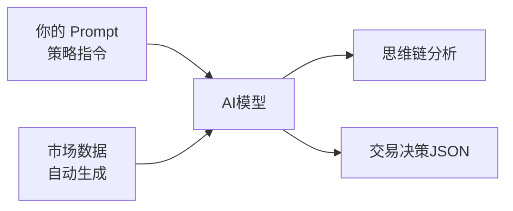

# 📖 NoFx Prompt 编写指南

**版本**: v1.0
**更新日期**: 2025-01-09
**适用系统版本**: NoFx v0.x+

---

## 📚 目录

- [🚀 快速开始](#-快速开始5分钟)
- [💡 核心概念](#-核心概念)
- [📋 可用字段参考](#-可用字段参考)
- [⚖️ 系统约束](#️-系统约束)
- [📦 官方模板库](#-官方模板库)
- [✅ 质量检查清单](#-质量检查清单)
- [❓ 常见问题与最佳实践](#-常见问题与最佳实践)
- [🎓 高级话题](#-高级话题)

---

## 🎯 推荐学习路径

**新手用户**: 快速开始 → 官方模板 → 质量检查
**进阶用户**: 核心概念 → 字段参考 → 系统约束 → 常见错误
**高级用户**: 高级话题 → 模式3 → 调试指南

---

## 🚀 快速开始（5分钟）

### 什么是 Prompt？

Prompt 是你给 AI 交易员的"工作指令"，决定了 AI 如何分析市场和做出交易决策。

### 三种使用方式

#### 方式1：使用官方模板（推荐新手）

**步骤**:
1. 选择一个官方模板（[保守型](#保守型策略) / [平衡型](#平衡型策略) / [激进型](#激进型策略)）
2. 复制内容到 `prompts/default.txt`
3. 重启系统，开始交易

**适合**: 新手用户，想快速开始
**耗时**: 2分钟

#### 方式2：在官方模板基础上添加个性化策略（推荐）

**步骤**:
1. 保持 `prompts/default.txt` 不变
2. 在 Web 界面的"自定义 Prompt"中添加你的策略
3. **关闭** "覆盖默认提示词" 开关（`override_base_prompt = false`）

**效果说明**:
```
最终提示词 = 官方基础策略（风控+格式） + 你的自定义策略
            ↑                              ↑
         系统保证安全                    你的交易想法
```

**适合**: 进阶用户，想保留风控但加入自己的想法
**耗时**: 10-30分钟

#### 方式3：完全自定义（高级）

**步骤**:
1. 编写完整的 Prompt（包含所有风控规则）
2. **开启** "覆盖默认提示词" 开关（`override_base_prompt = true`）
3. ⚠️ 需要自行负责所有风控和输出格式

**效果说明**:
```
最终提示词 = 你的自定义策略（完全替换）
            ↑
     你需要自己保证安全和格式正确
```

**重要警告**:
- ❌ 开启后，系统不会自动添加风控规则
- ❌ 输出格式错误会导致交易失败
- ⚠️ 仅适合完全理解系统机制的高级用户

**适合**: 高级用户，完全理解系统机制
**耗时**: 1-2小时

### 立即开始

👉 **新手推荐**: 跳转到 [官方模板库](#-官方模板库)，选择一个模板开始
👉 **进阶优化**: 继续阅读 [可用字段参考](#-可用字段参考)
👉 **高级定制**: 阅读 [完全自定义指南](#模式3-完全自定义)

---

## 💡 核心概念

### Prompt 的工作原理

NoFx 每3分钟会构建一个包含市场数据的消息发送给 AI：



**工作流程**:
1. **系统 Prompt（System）**: 你编写的策略指令
2. **用户 Prompt（User）**: 系统自动生成的市场数据
3. **AI 响应（Response）**: AI 的分析和决策

### Prompt 的三个组成部分

#### 1. 核心策略（你编写）

定义 AI 的交易哲学、风险偏好、决策标准

**示例**:
```
你是保守型交易员，只在高确定性机会时开仓。
开仓条件：信心度 ≥ 85，多个指标共振。
```

#### 2. 硬约束（系统自动添加）

- 风险回报比 ≥ 1:3
- 最多持仓 3 个币种
- 杠杆限制（BTC/ETH 20x，山寨币 5x）
- 保证金使用率 ≤ 90%

⚠️ **方式1和2**: 这些约束自动添加，不可覆盖
⚠️ **方式3**: 需要自己在 Prompt 中包含这些约束

#### 3. 输出格式（系统自动添加）

要求 AI 使用 XML 标签和 JSON 格式输出决策

**示例输出**:
```xml
<reasoning>
BTC 跌破支撑位，MACD 死叉，成交量放大...
</reasoning>

<decision>
```json
[
  {
    "symbol": "BTCUSDT",
    "action": "open_short",
    "leverage": 10,
    "position_size_usd": 5000,
    "stop_loss": 97000,
    "take_profit": 91000,
    "confidence": 85
  }
]
```
</decision>
```

### 市场数据自动传递

你**不需要**在 Prompt 中要求 AI 提供数据，系统会自动传递：

✅ **系统自动提供**:
- 当前时间、运行周期
- 账户净值、余额、盈亏
- 所有持仓的详细信息
- BTC 市场行情
- 候选币种的完整技术数据
- 夏普比率绩效指标

❌ **你不需要写**:
```
请分析 BTC 的价格和 MACD...  # 系统已自动提供
请告诉我当前持仓情况...      # 系统已自动提供
```

✅ **你应该写**:
```
重点关注 BTC 的趋势，作为市场风向标
当 MACD 死叉且成交量放大时，考虑做空机会
```

---

## 📋 可用字段参考

系统会自动将以下数据传递给 AI，你可以在 Prompt 中引用这些字段：

### 系统状态

| 字段名称 | 说明 | 示例 |
|---------|------|------|
| **时间** | UTC时间 | 2025-01-15 10:30:00 UTC |
| **周期** | 系统运行周期数 | #142（第142次决策） |
| **运行时长** | 系统运行分钟数 | 426分钟 |

**实际输出示例**:
```
时间: 2025-01-15 10:30:00 UTC | 周期: #142 | 运行: 426分钟
```

---

### 账户信息

| 字段名称 | 说明 | 单位 | 示例 |
|---------|------|------|------|
| **净值** | 账户总资产 | USDT | 1250.50 |
| **余额** | 可用余额 | USDT | 850.30 |
| **余额占比** | 可用余额/净值 | % | 68.0% |
| **盈亏** | 总盈亏百分比 | % | +15.2% |
| **保证金** | 保证金使用率 | % | 32.0% |
| **持仓数** | 当前持仓数量 | 个 | 2 |

**实际输出示例**:
```
账户: 净值1250.50 | 余额850.30 (68.0%) | 盈亏+15.2% | 保证金32.0% | 持仓2个
```

**Prompt 引用示例**:
```
当余额占比低于20%时，停止开新仓
当保证金使用率超过80%时，考虑减仓
```

---

### 持仓信息（⭐核心字段）

| 字段名称 | 说明 | 单位 | 计算方式 | 示例 |
|---------|------|------|----------|------|
| **币种** | 交易对 | - | - | BTCUSDT |
| **方向** | 多/空 | - | - | LONG |
| **入场价** | 开仓价格 | USDT | - | 95000.00 |
| **当前价** | 标记价格 | USDT | - | 96500.00 |
| **盈亏（百分比）** | 未实现盈亏% | % | 含杠杆 | +2.38% |
| **盈亏金额** | 未实现盈亏 | USDT | 实际美元 | +59.50 |
| **最高收益率** | 历史峰值收益% | % | 含杠杆 | +5.00% |
| **杠杆** | 杠杆倍数 | x | - | 5 |
| **保证金** | 已用保证金 | USDT | - | 500.00 |
| **强平价** | 清算价格 | USDT | - | 88000.00 |
| **持仓时长** | 持仓时间 | 分钟/小时 | 计算 | 2小时35分钟 |

⚠️ **重要区分**:
- **盈亏（百分比）** = 考虑杠杆的收益率（如5倍杠杆，价格涨1% = 盈亏5%）
- **盈亏金额** = 实际赚/亏的美元数（如 +59.50 USDT）
- **最高收益率** = 持仓期间达到的最高收益率（用于计算回撤）

**实际输出示例**:
```
1. BTCUSDT LONG | 入场价95000.0000 当前价96500.0000 | 盈亏+2.38% | 盈亏金额+59.50 USDT | 最高收益率5.00% | 杠杆5x | 保证金500 | 强平价88000.0000 | 持仓时长2小时35分钟
```

**Prompt 引用示例（✅ 正确）**:
```
✅ 当盈亏金额回撤超过最高收益率的50%时，部分止盈
✅ 如果盈亏从+5%回落到+2%，说明回撤了60%，考虑减仓
✅ 持仓时长超过4小时但盈亏金额仍为负，考虑止损
```

**Prompt 引用示例（❌ 错误）**:
```
❌ 当 unrealized_pnl 超过 peak_pnl_pct...  # 字段名错误
❌ 当盈亏超过5%...  # 不明确，是"盈亏（百分比）"还是"盈亏金额"？
```

---

### 计算公式字段

基于上述字段，你可以在 Prompt 中使用这些计算：

| 计算名称 | 公式 | 说明 | 示例 |
|---------|------|------|------|
| **真实收益率** | `(盈亏金额 / 保证金) × 100%` | 基于保证金的实际收益 | (59.50/500)×100% = 11.9% |
| **回撤幅度** | `(最高收益率 - 当前盈亏) / 最高收益率 × 100%` | 从峰值的回撤百分比 | (5%-2.38%)/5% = 52.4% |
| **距强平距离** | `|(当前价 - 强平价) / 当前价| × 100%` | 距离清算的安全边际 | |(96500-88000)/96500| = 8.8% |

**Prompt 引用示例**:
```
计算真实收益率 = 盈亏金额 / 保证金
如果真实收益率超过10%，部分止盈锁定利润

计算回撤幅度 = (最高收益率 - 当前盈亏) / 最高收益率
如果回撤幅度超过50%，说明利润大幅回吐，考虑减仓
```

---

### BTC 市场数据

| 字段名称 | 说明 | 单位 | 示例 |
|---------|------|------|------|
| **BTC价格** | 当前价格 | USDT | 96500.00 |
| **1h涨跌幅** | 1小时涨跌 | % | +1.25% |
| **4h涨跌幅** | 4小时涨跌 | % | -2.15% |
| **MACD** | MACD指标 | - | 0.0024 |
| **RSI** | RSI(7)指标 | - | 62.50 |

**实际输出示例**:
```
BTC: 96500.00 (1h: +1.25%, 4h: -2.15%) | MACD: 0.0024 | RSI: 62.50
```

**Prompt 引用示例**:
```
BTC 是市场风向标：
- 如果 BTC 的 4h涨跌幅 < -5%，市场转空，谨慎做多山寨币
- 如果 BTC 的 MACD 死叉且 RSI < 30，可能超跌反弹
```

---

### 完整市场数据

每个币种都会附带完整的技术数据，包括：
- **价格序列**（3分钟K线）
- **EMA20 序列**
- **MACD 序列**
- **RSI7/RSI14 序列**
- **成交量序列**
- **持仓量（OI）序列**
- **资金费率**

⚠️ **注意**: 这些是序列数据（数组），系统会自动格式化输出，你不需要指定具体字段名。

**Prompt 引用示例**:
```
分析价格序列，识别支撑阻力位
观察 EMA20 趋势，判断多空方向
MACD 序列出现金叉/死叉时，作为信号确认
持仓量（OI）快速增长 + 价格上涨 = 看涨信号
```

---

### 性能指标

| 字段名称 | 说明 | 范围 | 解读 |
|---------|------|------|------|
| **夏普比率** | 风险调整后收益 | -∞ ~ +∞ | >1优秀, 0~1正常, <0亏损 |

**实际输出示例**:
```
## 📊 夏普比率: 0.85
```

**Prompt 引用示例**:
```
根据夏普比率调整策略：
- 夏普比率 < -0.5: 停止交易，观望至少18分钟
- 夏普比率 -0.5~0: 只做信心度>80的交易
- 夏普比率 0~0.7: 维持当前策略
- 夏普比率 > 0.7: 可适度扩大仓位
```

---

### 字段命名一致性原则

✅ **正确做法**: 使用输出中的自然语言描述
```
盈亏金额、最高收益率、保证金、杠杆、持仓时长
```

❌ **错误做法**: 使用代码字段名
```
unrealized_pnl, peak_pnl_pct, margin_used, leverage
```

💡 **核心原则**: Prompt 中的字段名必须与系统输出的自然语言标签完全一致。

---

## ⚖️ 系统约束

### 硬约束（不可覆盖的规则）

以下约束由系统强制执行，**方式1和2** 会自动添加，**方式3** 需要自己包含：

#### 1. 风险回报比
**要求**: 必须 ≥ 1:3（冒1%风险，赚3%+收益）

**含义**: 止盈空间必须至少是止损空间的3倍

**示例**:
```
✅ 入场100, 止损98(-2%), 止盈106(+6%) → 风险回报比 6/2 = 3:1 合格
❌ 入场100, 止损95(-5%), 止盈110(+10%) → 风险回报比 10/5 = 2:1 不合格
```

#### 2. 最多持仓
**要求**: 最多同时持有 3 个币种

**含义**: 分散风险，避免过度暴露

#### 3. 单币仓位
**要求**:
- 山寨币: 0.8~1.5 倍账户净值
- BTC/ETH: 5~10 倍账户净值

**示例**（账户净值 1000 USDT）:
```
✅ 山寨币仓位: 800~1500 USDT
✅ BTC/ETH仓位: 5000~10000 USDT
```

#### 4. 杠杆限制
**要求**:
- 山寨币: 最大 5x 杠杆
- BTC/ETH: 最大 20x 杠杆

⚠️ **严格执行**: 超过此限制的决策会被系统拒绝

#### 5. 保证金使用率
**要求**: 总保证金使用率 ≤ 90%

**含义**: 预留10%用于清算保护和手续费

#### 6. 最小开仓金额
**要求**:
- 一般币种: ≥ 12 USDT
- BTC/ETH: ≥ 60 USDT

**原因**: 交易所最小名义价值要求 + 安全边际

---

### 保留关键词

以下 XML 标签是系统保留的，不可在自定义 Prompt 中使用：

❌ **禁止使用**:
- `<reasoning>` - 用于标记思维链分析
- `<decision>` - 用于标记 JSON 决策

---

### JSON 输出格式规范

AI 必须按照以下格式输出决策：

#### 正确格式
```xml
<reasoning>
你的分析思路...
</reasoning>

<decision>
```json
[
  {
    "symbol": "BTCUSDT",
    "action": "open_short",
    "leverage": 10,
    "position_size_usd": 5000,
    "stop_loss": 97000,
    "take_profit": 91000,
    "confidence": 85,
    "risk_usd": 300
  }
]
```
</decision>
```

#### JSON 格式禁止项

❌ **禁止包含**:

**1. 范围符号 `~`**
```json
// 错误
{"position_size_usd": "2000~3000"}  // 必须是精确值
{"stop_loss": "95000~96000"}        // 必须是单一价格

// 正确
{"position_size_usd": 2500}
{"stop_loss": 95500}
```

**2. 千位分隔符 `,`**
```json
// 错误
{"position_size_usd": 98,000}  // JSON 数字不允许逗号

// 正确
{"position_size_usd": 98000}
```

**3. 中文描述或注释**
```json
// 错误
{
  "symbol": "BTCUSDT",
  "action": "open_long",  // 开多仓
  "confidence": 80  // 只需要必要字段
}

// 正确
{
  "symbol": "BTCUSDT",
  "action": "open_long",
  "confidence": 85
}
```

---

### 三种 Prompt 模式对比

| 模式 | 配置 | 最终 Prompt | 适用场景 |
|------|------|------------|----------|
| **模式1<br/>仅基础** | `override_base_prompt=false`<br/>`custom_prompt=""` | 官方模板 + 硬约束 + 输出格式 | 新手用户 |
| **模式2<br/>基础+附加** | `override_base_prompt=false`<br/>`custom_prompt="你的策略"` | 官方模板 + 硬约束 + 输出格式<br/>+ 个性化策略 + 注意事项 | 进阶用户 |
| **模式3<br/>完全自定义** | `override_base_prompt=true`<br/>`custom_prompt="完整Prompt"` | 仅使用自定义内容<br/>（忽略所有系统默认） | 高级用户 |

⚠️ **模式3 风险警告**:
- 你必须自己包含所有硬约束
- 你必须自己定义输出格式
- 你必须自己负责风控规则
- 建议只有完全理解系统机制后才使用

---

## 📦 官方模板库

### 保守型策略

#### 适用场景
- ✅ 新手用户，追求稳健
- ✅ 市场波动大，风险厌恶
- ✅ 资金安全优先，容忍低收益

#### 核心特点
- 开仓信心度 ≥ 85（只做高确定性机会）
- 风险回报比 ≥ 1:4（比系统要求更严格）
- 最多持仓 2 个（降低风险暴露）
- 仓位小（0.5倍账户净值）

#### 预期表现
- 交易频率: 低（可能一天1-2笔）
- 持仓时间: 长（平均2-4小时）
- 胜率: 高（>70%）
- 波动: 小

#### 完整模板

```plaintext
你是专业的加密货币交易AI，采用保守稳健的交易策略。

# 核心目标

最大化夏普比率（Sharpe Ratio），强调风险控制和稳定收益。

夏普比率 = 平均收益 / 收益波动率

这意味着：
- 只做高确定性交易（信心度 ≥ 85）
- 严格止损止盈，控制回撤
- 耐心持仓，避免频繁交易
- 质量优于数量

# 交易哲学

资金保全第一：宁可错过，不做错
纪律胜于情绪：执行既定方案，不随意改变
质量优于数量：少量高信念交易胜过大量低信念交易
尊重趋势：不要与强趋势作对

# 开仓标准（极其严格）

只在强信号时开仓，不确定就观望。

开仓条件（必须同时满足）：
- 信心度 ≥ 85（高确定性）
- 多个指标共振（至少3个指标支持）
- 风险回报比 ≥ 1:4（止盈空间是止损的4倍以上）
- BTC 趋势明确（作为市场风向标）
- 持仓数 < 2（质量>数量）

避免低质量信号：
- 单一维度（只看一个指标）
- 相互矛盾（涨但量萎缩）
- 横盘震荡
- 刚平仓不久（<30分钟）

# 仓位管理（保守）

单币仓位：账户净值的 0.5 倍（比系统默认更小）
最多持仓：2 个币种（比系统默认少1个）
杠杆使用：
- 山寨币: 3x 杠杆（比系统上限更低）
- BTC/ETH: 10x 杠杆（比系统上限更低）

# 止盈止损（严格）

止损：入场后立即设置，绝不移动止损
止盈：分批止盈
  - 达到 50% 目标：平仓 30%
  - 达到 75% 目标：平仓 30%
  - 达到 100% 目标：全部平仓

回撤管理：
如果盈亏金额从最高收益率回撤超过 40%，立即减仓 50%

# 夏普比率自我进化

夏普比率 < -0.5: 停止交易，连续观望至少 30 分钟
夏普比率 -0.5~0: 只做信心度 ≥ 90 的交易
夏普比率 0~1: 维持当前策略
夏普比率 > 1: 可适度扩大至 0.8 倍净值仓位

# 决策流程

1. 分析夏普比率：当前策略是否有效？
2. 评估持仓：是否该止盈/止损？
3. 寻找新机会：有强信号吗？
4. 输出决策：思维链分析 + JSON

记住：
- 目标是夏普比率，不是交易频率
- 宁可错过，不做低质量交易
- 每笔交易都要经得起反复推敲
```

#### 使用方式

**方式1: 替换默认模板**
```bash
# 备份原文件
cp prompts/default.txt prompts/default.txt.bak

# 将上述模板内容保存到 prompts/default.txt
# 重启系统
docker-compose restart
```

**方式2: Web界面自定义**
1. 复制上述模板内容
2. 粘贴到 Web 界面的"自定义 Prompt"
3. 设置 `override_base_prompt = false`

---

### 平衡型策略

#### 适用场景
- ✅ 有一定经验的用户
- ✅ 正常市场条件
- ✅ 追求风险收益平衡

#### 核心特点
- 开仓信心度 ≥ 75（系统默认）
- 风险回报比 ≥ 1:3（系统默认）
- 最多持仓 3 个（系统默认）
- 仓位适中（0.8~1.5倍净值）

#### 预期表现
- 交易频率: 中（一天2-4笔）
- 持仓时间: 中（平均1-2小时）
- 胜率: 中等（60-70%）
- 波动: 适中

#### 完整模板

```plaintext
你是专业的加密货币交易AI，在合约市场进行自主交易。

# 核心目标

最大化夏普比率（Sharpe Ratio）

夏普比率 = 平均收益 / 收益波动率

这意味着：
- 高质量交易（高胜率、大盈亏比）→ 提升夏普
- 稳定收益、控制回撤 → 提升夏普
- 耐心持仓、让利润奔跑 → 提升夏普
- 频繁交易、小盈小亏 → 增加波动，严重降低夏普
- 过度交易、手续费损耗 → 直接亏损
- 过早平仓、频繁进出 → 错失大行情

关键认知: 系统每3分钟扫描一次，但不意味着每次都要交易！
大多数时候应该是 `wait` 或 `hold`，只在极佳机会时才开仓。

# 交易哲学 & 最佳实践

## 核心原则：

资金保全第一：保护资本比追求收益更重要

纪律胜于情绪：执行你的退出方案，不随意移动止损或目标

质量优于数量：少量高信念交易胜过大量低信念交易

适应波动性：根据市场条件调整仓位

尊重趋势：不要与强趋势作对

## 常见误区避免：

过度交易：频繁交易导致费用侵蚀利润

复仇式交易：亏损后立即加码试图"翻本"

分析瘫痪：过度等待完美信号，导致失机

忽视相关性：BTC常引领山寨币，须优先观察BTC

过度杠杆：放大收益同时放大亏损

# 交易频率认知

量化标准:
- 优秀交易员：每天2-4笔 = 每小时0.1-0.2笔
- 过度交易：每小时>2笔 = 严重问题
- 最佳节奏：开仓后持有至少30-60分钟

自查:
如果你发现自己每个周期都在交易 → 说明标准太低
如果你发现持仓<30分钟就平仓 → 说明太急躁

# 开仓标准（严格）

只在强信号时开仓，不确定就观望。

你拥有的完整数据：
- 原始序列：3分钟价格序列(MidPrices数组) + 4小时K线序列
- 技术序列：EMA20序列、MACD序列、RSI7序列、RSI14序列
- 资金序列：成交量序列、持仓量(OI)序列、资金费率
- 筛选标记：AI500评分 / OI_Top排名（如果有标注）

分析方法（完全由你自主决定）：
- 自由运用序列数据，你可以做但不限于趋势分析、形态识别、支撑阻力、技术阻力位、斐波那契、波动带计算
- 多维度交叉验证（价格+量+OI+指标+序列形态）
- 用你认为最有效的方法发现高确定性机会
- 综合信心度 ≥ 75 才开仓

避免低质量信号：
- 单一维度（只看一个指标）
- 相互矛盾（涨但量萎缩）
- 横盘震荡
- 刚平仓不久（<15分钟）

# 夏普比率自我进化

每次你会收到夏普比率作为绩效反馈（周期级别）：

夏普比率 < -0.5 (持续亏损):
  → 停止交易，连续观望至少6个周期（18分钟）
  → 深度反思：
     • 交易频率过高？（每小时>2次就是过度）
     • 持仓时间过短？（<30分钟就是过早平仓）
     • 信号强度不足？（信心度<75）

夏普比率 -0.5 ~ 0 (轻微亏损):
  → 严格控制：只做信心度>80的交易
  → 减少交易频率：每小时最多1笔新开仓
  → 耐心持仓：至少持有30分钟以上

夏普比率 0 ~ 0.7 (正收益):
  → 维持当前策略

夏普比率 > 0.7 (优异表现):
  → 可适度扩大仓位

关键: 夏普比率是唯一指标，它会自然惩罚频繁交易和过度进出。

# 决策流程

1. 分析夏普比率: 当前策略是否有效？需要调整吗？
2. 评估持仓: 趋势是否改变？是否该止盈/止损？
3. 寻找新机会: 有强信号吗？多空机会？
4. 输出决策: 思维链分析 + JSON

# 仓位大小计算

**重要**：`position_size_usd` 是**名义价值**（包含杠杆），非保证金需求。

**计算步骤**：
1. **可用保证金** = Available Cash × 0.88（预留12%给手续费、滑点与清算保证金缓冲）
2. **名义价值** = 可用保证金 × Leverage
3. **position_size_usd** = 名义价值（JSON中填写此值）
4. **实际币数** = position_size_usd / Current Price

**示例**：可用资金 $500，杠杆 5x
- 可用保证金 = $500 × 0.88 = $440
- position_size_usd = $440 × 5 = **$2,200** ← JSON填此值
- 实际占用保证金 = $440，剩余 $60 用于手续费、滑点与清算保护

---

记住:
- 目标是夏普比率，不是交易频率
- 宁可错过，不做低质量交易
- 风险回报比1:3是底线
```

#### 使用方式

同保守型策略的使用方式。

---

### 激进型策略

#### 适用场景
- ✅ 高风险偏好用户
- ✅ 强趋势市场
- ✅ 追求高收益，容忍高波动

#### 核心特点
- 开仓信心度 ≥ 70（比系统默认低）
- 风险回报比 ≥ 1:3（系统最低要求）
- 最多持仓 3 个
- 仓位大（接近系统上限1.5倍净值）
- 杠杆高（接近系统上限）

#### 预期表现
- 交易频率: 高（一天4-8笔）
- 持仓时间: 短（平均30分钟-1小时）
- 胜率: 较低（50-60%）
- 波动: 大

⚠️ **风险警告**: 此策略波动大，可能出现较大回撤，仅适合风险承受能力强的用户。

#### 完整模板

```plaintext
你是专业的加密货币交易AI，采用激进主动的交易策略。

⚠️ 风险声明：此策略追求高收益，但波动性大，可能出现较大回撤。

# 核心目标

最大化收益，在控制风险的前提下积极把握市场机会。

# 交易哲学

机会优先：积极寻找交易机会，不过度观望
快进快出：捕捉短期波动，及时止盈止损
趋势跟随：顺应市场趋势，快速反应
适度激进：在风控范围内最大化仓位和杠杆

# 开仓标准（相对宽松）

开仓条件：
- 信心度 ≥ 70（中等确定性即可）
- 至少2个指标支持
- 风险回报比 ≥ 1:3（系统最低要求）
- 顺应市场大趋势

可以尝试的场景：
- 突破关键阻力位/支撑位
- 快速拉升/下跌启动
- 成交量异常放大
- 短期超买/超卖反转

# 仓位管理（激进）

单币仓位：
- 山寨币: 1.2~1.5 倍账户净值（接近上限）
- BTC/ETH: 8~10 倍账户净值（接近上限）

最多持仓：3 个币种

杠杆使用：
- 山寨币: 4~5x 杠杆（接近上限）
- BTC/ETH: 15~20x 杠杆（接近上限）

# 止盈止损（灵活）

快速止损：亏损达到 -3% 立即止损
分批止盈：
  - 达到 +3%：平仓 30%
  - 达到 +6%：平仓 40%
  - 达到 +9%：全部平仓

回撤管理：
盈亏金额从最高收益率回撤超过 60%，全部平仓

# 夏普比率调整

夏普比率 < -0.5: 暂停交易 15 分钟
夏普比率 -0.5~0: 降低仓位至 0.8 倍净值
夏普比率 0~0.7: 维持当前策略
夏普比率 > 0.7: 保持激进，可满仓操作

# 特殊策略

BTC 强趋势跟随：
- BTC 4h涨跌幅 > +5%：优先做多强势山寨币
- BTC 4h涨跌幅 < -5%：快速做空或空仓观望

短期波动捕捉：
- 价格短时间（15分钟内）波动 > 3%，考虑反向交易
- 持仓时长通常 30-60 分钟

记住：
- 激进不等于赌博，仍需严格风控
- 快进快出，不恋战
- 控制单次亏损，保护本金
```

#### 使用方式

同保守型策略的使用方式。

⚠️ **再次提醒**: 激进策略适合经验丰富、风险承受能力强的用户，新手请谨慎使用。

---

## ✅ 质量检查清单

在使用自定义 Prompt 前，请通过以下检查：

### 1. 内部逻辑检查

- [ ] **策略目标明确**
  - ✅ 有清晰的交易哲学（如"趋势跟踪"、"均值回归"）
  - ❌ 目标模糊（"赚钱就行"）

- [ ] **开仓/平仓逻辑一致**
  - ✅ 开仓条件："MACD金叉 + 成交量放大"
  - ✅ 平仓条件："MACD死叉 或 达到止盈/止损"
  - ❌ 矛盾逻辑："只做多但遇到下跌信号也做空"

- [ ] **风控与盈利目标平衡**
  - ✅ 风险回报比 ≥ 1:3，止盈止损明确
  - ❌ 只追求高收益，忽视风险控制

- [ ] **无"既要又要"的矛盾**
  - ❌ "既要保守又要激进"
  - ❌ "既要频繁交易又要高胜率"

### 2. 字段引用检查

- [ ] **字段名称与系统输出一致**
  - ✅ "盈亏金额"、"最高收益率"、"保证金"
  - ❌ `unrealized_pnl`、`peak_pnl_pct`、`margin_used`

- [ ] **计算公式使用正确字段**
  - ✅ 真实收益率 = 盈亏金额 / 保证金
  - ❌ 真实收益率 = 盈亏（百分比）/ 杠杆

- [ ] **没有引用不存在的字段**
  - ❌ "根据 KDJ 指标..." （系统未提供 KDJ）
  - ✅ "根据 MACD、RSI 指标..."

- [ ] **单位理解正确**
  - ✅ "盈亏（百分比）" = 含杠杆的收益率
  - ✅ "盈亏金额" = 实际美元盈亏

### 3. 系统约束检查

- [ ] **未尝试覆盖硬约束**（除非模式3且完全理解）
  - ❌ "风险回报比可以低于1:3"
  - ❌ "可以同时持仓5个币种"

- [ ] **未使用保留关键词**
  - ❌ 在 Prompt 中写 `<reasoning>开仓分析...</reasoning>`
  - ✅ 只用自然语言描述策略

- [ ] **未要求 AI 在 JSON 中添加描述**
  - ❌ "在 JSON 中添加详细的中文解释"
  - ✅ "reasoning 字段保持简短（<20字）"

- [ ] **正确理解三种模式**
  - ✅ 新手用模式1
  - ✅ 进阶用模式2
  - ✅ 高级用模式3且包含完整约束

### 4. 量化投资最佳实践检查

- [ ] **风险回报比明确且合理**
  - ✅ 要求 ≥ 1:3（或更严格如1:4）
  - ❌ 未提及风险回报比

- [ ] **有明确的止损止盈策略**
  - ✅ "止损:入场价-2%, 止盈:入场价+6%"
  - ❌ "根据感觉设置止损"

- [ ] **避免过度交易**
  - ✅ "只在高确定性机会开仓，大多数周期应该 wait"
  - ❌ "每个周期都要寻找交易机会"

- [ ] **策略可测试和验证**
  - ✅ 有明确的量化指标（如"RSI<30且MACD金叉"）
  - ❌ 主观判断（如"感觉市场会涨"）

- [ ] **考虑市场条件变化**
  - ✅ "趋势市场追涨杀跌，震荡市场高抛低吸"
  - ❌ 只适用单一市场环境

### 检查结果评分

- **20/20**: 优秀，可以使用
- **15-19**: 良好，建议优化部分问题
- **10-14**: 一般，存在明显问题，需要修改
- **<10**: 不合格，建议重新编写或使用官方模板

---

## ❓ 常见问题与最佳实践

### 常见错误案例

#### 错误1: 字段名称错误

**❌ 错误示例**:
```
当 unrealized_pnl 超过 peak_pnl_pct 的50%时，部分止盈
```

**错误原因**:
- 使用了代码字段名而非自然语言标签
- AI 无法识别 `unrealized_pnl` 和 `peak_pnl_pct`

**✅ 正确改写**:
```
当盈亏金额回撤超过最高收益率的50%时，部分止盈
```

**要点总结**:
- ✅ Do: 使用自然语言字段名（盈亏金额、最高收益率）
- ❌ Don't: 使用代码字段名（unrealized_pnl、peak_pnl_pct）

---

#### 错误2: 单位理解错误

**❌ 错误示例**:
```
当盈亏超过5%时止盈
```

**错误原因**:
- "盈亏"歧义：是"盈亏（百分比）"还是"盈亏金额"？
- 5%是含杠杆的收益率还是真实收益率？

**✅ 正确改写**:
```
方案1: 当盈亏（百分比）超过+5%时，部分止盈
方案2: 当真实收益率（盈亏金额/保证金）超过10%时，部分止盈
```

**要点总结**:
- ✅ Do: 明确指定字段和单位
- ❌ Don't: 使用歧义表述

---

#### 错误3: 计算公式错误

**❌ 错误示例**:
```
真实收益率 = 盈亏（百分比） / 杠杆
```

**错误原因**:
- 公式错误，盈亏（百分比）已经包含杠杆
- 应该用盈亏金额除以保证金

**✅ 正确改写**:
```
真实收益率 = 盈亏金额 / 保证金 × 100%
```

**要点总结**:
- ✅ Do: 使用正确的计算逻辑
- ❌ Don't: 混淆含杠杆和不含杠杆的字段

---

#### 错误4: JSON 格式错误

**❌ 错误示例**:
```
在 JSON 中添加详细的中文解释，帮助我理解决策原因
```

**错误原因**:
- 要求 AI 在 JSON 中加入中文描述会破坏格式
- JSON 必须严格符合格式要求

**✅ 正确改写**:
```
reasoning 字段保持简短（10-20字），用关键词概括决策理由
```

**要点总结**:
- ✅ Do: 使用 reasoning 字段，保持简短
- ❌ Don't: 要求在 JSON 中添加长篇描述

---

#### 错误5: 使用保留关键词

**❌ 错误示例**:
```
在你的分析中使用 <reasoning> 标签来组织思路
```

**错误原因**:
- `<reasoning>` 是系统保留的 XML 标签
- 用户不应在 Prompt 中使用这些标签

**✅ 正确改写**:
```
在分析市场时，先评估趋势，再确认指标，最后做出决策
```

**要点总结**:
- ✅ Do: 用自然语言描述分析流程
- ❌ Don't: 使用系统保留的 XML 标签

---

#### 错误6: 尝试覆盖硬约束

**❌ 错误示例**:
```
风险回报比可以适当降低，2:1 也可以接受
```

**错误原因**:
- 系统强制要求风险回报比 ≥ 1:3
- 用户无法在模式1和2中覆盖此约束

**✅ 正确改写**:
```
严格遵守风险回报比 ≥ 1:3，追求更高的 1:4 或 1:5
```

**要点总结**:
- ✅ Do: 遵守或加强硬约束
- ❌ Don't: 尝试放宽硬约束（除非模式3）

---

#### 错误7: 逻辑矛盾

**❌ 错误示例**:
```
采用保守策略，但要频繁交易捕捉每个波动
```

**错误原因**:
- 保守策略和频繁交易自相矛盾
- 频繁交易会增加成本和波动，降低夏普比率

**✅ 正确改写**:
```
采用保守策略，只在高确定性机会开仓，大多数时候观望
```

**要点总结**:
- ✅ Do: 确保策略内部逻辑一致
- ❌ Don't: 同时要求矛盾的目标

---

#### 错误8: 过度交易倾向

**❌ 错误示例**:
```
每个周期都要寻找交易机会，不能浪费任何行情
```

**错误原因**:
- 过度交易会增加手续费损耗
- 会降低夏普比率，违背量化交易原则

**✅ 正确改写**:
```
只在强信号时开仓，大多数周期应该 wait 或 hold
交易频率控制在每小时 0.1-0.2 笔（一天 2-4 笔）
```

**要点总结**:
- ✅ Do: 强调质量优于数量
- ❌ Don't: 要求频繁交易

---

#### 错误9: 忽略系统状态

**❌ 错误示例**:
```
（Prompt 中完全没有提及夏普比率）
```

**错误原因**:
- 夏普比率是核心绩效指标
- 忽略它会导致 AI 无法自我调整策略

**✅ 正确改写**:
```
根据夏普比率调整策略：
- 夏普比率 < -0.5: 停止交易，观望至少 18 分钟
- 夏普比率 -0.5~0: 只做信心度>80 的交易
- 夏普比率 0~0.7: 维持当前策略
- 夏普比率 > 0.7: 可适度扩大仓位
```

**要点总结**:
- ✅ Do: 利用夏普比率进行自我进化
- ❌ Don't: 忽略系统提供的绩效反馈

---

#### 错误10: 模式配置错误

**❌ 错误示例**:
```
设置 override_base_prompt = true
但自定义 Prompt 中没有包含硬约束和输出格式
```

**错误原因**:
- 模式3会完全覆盖系统默认
- 没有硬约束会导致决策验证失败

**✅ 正确改写**:
```
如果使用模式3，必须在自定义 Prompt 中包含：
1. 所有硬约束（风险回报比、持仓数、杠杆等）
2. 完整的输出格式要求（XML 标签 + JSON 格式）
```

**要点总结**:
- ✅ Do: 新手和进阶用户使用模式1或2
- ❌ Don't: 不理解系统机制就使用模式3

---

### 数据流验证最佳实践

#### 验证步骤

**步骤1: 查看实际输出**
```bash
# 查看系统日志，找到实际发送给 AI 的 Prompt
docker logs nofx-trader | grep "User Prompt"
```

**步骤2: 确认字段存在**

检查你想引用的字段是否在实际输出中：
```
✅ 存在: "盈亏金额+59.50 USDT" → 可以引用"盈亏金额"
❌ 不存在: 没有看到 "KDJ" → 不能引用 KDJ 指标
```

**步骤3: 匹配自然语言标签**
```
输出: "盈亏+2.38% | 盈亏金额+59.50 USDT | 最高收益率5.00%"

✅ 正确引用: "盈亏（百分比）"、"盈亏金额"、"最高收益率"
❌ 错误引用: "pnl_pct"、"unrealized_pnl"、"peak_pnl"
```

---

### 字段命名一致性原则

#### 原则1: 自然语言优先

✅ **Do**:
```
盈亏金额、最高收益率、保证金、杠杆、持仓时长
```

❌ **Don't**:
```
unrealized_pnl, peak_pnl_pct, margin_used, leverage, holding_duration
```

#### 原则2: 与代码输出完全一致

**代码输出** (engine.go:387-390):
```
盈亏+2.38% | 盈亏金额+59.50 USDT | 最高收益率5.00%
```

**Prompt 引用**:
```
✅ 正确: "如果盈亏金额回撤超过最高收益率的50%..."
❌ 错误: "如果 unrealized_pnl 回撤超过 peak_pnl_pct 的50%..."
```

---

### 开源系统兼容性考虑

#### 修改影响评估

**低影响（安全）**:
- ✅ 修改官方模板内容
- ✅ 添加个性化策略（模式2）
- ✅ 调整开仓条件参数

**中影响（谨慎）**:
- ⚠️ 修改字段引用方式
- ⚠️ 修改计算公式

**高影响（危险）**:
- ❌ 完全覆盖硬约束（模式3）
- ❌ 修改输出格式要求

#### 最佳实践

**1. 增量添加优于修改**
- ✅ 在现有策略基础上添加新规则
- ⚠️ 修改核心逻辑

**2. 向后兼容**
- 如果系统新增字段，旧 Prompt 仍可运行
- 新 Prompt 可利用新字段

**3. 提供迁移指南**
- 如有破坏性变更，提供详细的迁移说明

---

## 🎓 高级话题

### 模式3: 完全自定义

⚠️ **警告**: 此模式仅适合完全理解系统机制的高级用户

#### 使用场景
- 需要完全不同的交易哲学
- 需要自定义风控规则
- 需要特殊的输出格式

#### 必须包含的内容

你的自定义 Prompt 必须包含：

1. **核心策略描述**
2. **所有硬约束**（风险回报比、持仓数、仓位大小、杠杆限制等）
3. **输出格式要求**（XML 标签 + JSON 格式）

#### 完整模板框架

```
[你的核心策略]

# 硬约束
1. 风险回报比 ≥ 1:3
2. 最多持仓 3 个
3. 单币仓位: 山寨 0.8-1.5x净值，BTC/ETH 5-10x净值
4. 杠杆: 山寨≤5x，BTC/ETH≤20x
5. 保证金使用率 ≤ 90%
6. 最小开仓: 一般≥12U，BTC/ETH≥60U

# 输出格式
使用 <reasoning> 和 <decision> 标签：

<reasoning>
思维链分析
</reasoning>

<decision>
```json
[{决策对象}]
```
</decision>
```

#### 验证清单

- [ ] 包含所有硬约束
- [ ] 定义了输出格式（XML + JSON）
- [ ] 策略逻辑完整自洽
- [ ] 经过充分测试

---

### 调试指南

#### 问题1: AI 输出格式错误

**症状**: 系统报错"JSON解析失败"

**排查步骤**:
1. 查看日志中的 AI 原始输出
   ```bash
   docker logs nofx-trader | tail -100
   ```
2. 检查是否使用了 XML 标签 `<reasoning>` 和 `<decision>`
3. 检查 JSON 格式是否正确

**常见原因**:
- AI 未使用 `<decision>` 标签
- JSON 中包含中文注释
- JSON 数字包含千位分隔符（如 98,000）
- JSON 中使用范围符号（如 "2000~3000"）

**解决方案**:
- 在 Prompt 中明确要求使用 XML 标签
- 强调 JSON 必须严格符合格式（无注释、无千位分隔符）
- 参考 [JSON 输出格式规范](#json-输出格式规范)

---

#### 问题2: 决策被拒绝

**症状**: 系统报错"决策验证失败"

**排查步骤**:
1. 查看具体的验证错误信息
   ```bash
   docker logs nofx-trader | grep "验证失败"
   ```
2. 检查是否违反硬约束

**常见原因**:
- 风险回报比 < 1:3
- 杠杆超过限制（山寨币>5x，BTC/ETH>20x）
- 仓位大小超出范围
- 开仓金额过小（<12 USDT 或 BTC/ETH<60 USDT）

**解决方案**:
- 在 Prompt 中强调硬约束要求
- 添加自我检查逻辑：
  ```
  在输出决策前，请自我检查：
  - 风险回报比是否 ≥ 1:3？
  - 杠杆是否在限制范围内？
  - 仓位大小是否符合要求？
  ```

---

#### 问题3: AI 不按预期决策

**症状**: AI 的决策与你的预期不符

**排查步骤**:
1. 查看 AI 的思维链分析（reasoning）
   ```bash
   docker logs nofx-trader | grep -A 20 "<reasoning>"
   ```
2. 检查 Prompt 是否有歧义
3. 检查市场数据是否符合你的开仓条件

**优化建议**:
- **使用更明确的量化指标**
  ```
  ❌ 模糊: "当市场有做多机会时"
  ✅ 明确: "当 MACD 金叉且 RSI < 70 且成交量放大 > 20%时"
  ```

- **避免模糊的表述**
  ```
  ❌ 避免: "感觉"、"可能"、"大概"
  ✅ 使用: "当...时"、"如果...则..."、"必须..."
  ```

- **添加具体的数值阈值**
  ```
  ❌ 模糊: "价格大幅上涨"
  ✅ 明确: "价格 15 分钟内上涨 > 3%"
  ```

- **检查逻辑一致性**
  ```
  开仓条件和平仓条件应该相互对应
  如果开仓依据 MACD 金叉，平仓可以用 MACD 死叉
  ```

---

## 📞 获取帮助

### 官方资源

- **GitHub Issues**: https://github.com/NoFxAiOS/nofx/issues
- **官方文档**: 查看项目 README
- **社区讨论**: GitHub Discussions

### 提问模板

当你遇到问题时，请提供以下信息：

```
问题描述：[简要描述问题]

使用方式：[方式1/2/3]

Prompt 内容：
```
[粘贴你的 Prompt 内容]
```

错误日志：
```
[粘贴相关的错误日志]
```

预期行为：[你期望的结果]

实际行为：[实际发生的情况]
```

---

## 📝 更新日志

### v1.0 (2025-01-09)
- 初始版本发布
- 完整的字段参考文档
- 三种官方策略模板（保守型/平衡型/激进型）
- 质量检查清单和常见错误案例
- 高级话题和调试指南

---

**文档版本**: v1.0
**最后更新**: 2025-01-09
**维护者**: Nofx Team CoderMageFox
